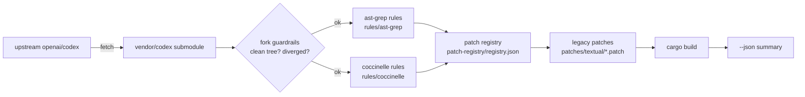

# codex-patcher-updater

<div align="right">

[](https://www.rust-lang.org/)
[](#license)
[](#-retired)

</div>

> **⚠️ Retired.** Active development now lives in the standalone
> [**codex-forksmith**](https://github.com/toxicwind/codex-forksmith) repo
> (*"Rust control plane for the vendored Codex workspace — inspect, sync,
> build, exec."*). This tree is frozen and kept only for historical reference.

**codex-patcher-updater** was the Rust-native patch-and-update pipeline for a
vendored [openai/codex](https://github.com/openai/codex) fork. It pulled
upstream, applied semantic patch sets with
[ast-grep](https://ast-grep.github.io/) and
[coccinelle-for-rust](https://github.com/coccinelle/coccinelle) rules, tracked
everything in a JSON patch registry, and rebuilt — so a fork could be kept
current and re-customized in one command.

## Features

- **Vendored upstream** — `openai/codex` pinned as a git submodule under
  `vendor/codex`; the pipeline always mutates exactly the code you see
- **Semantic patch engines** — ast-grep (enabled) and coccinelle-for-rust
  (opt-in) apply structural rules, not brittle line diffs
- **Patch registry** — `patch-registry/registry.json` is the single source of
  truth: list, explain, enable, and disable patch sets by id
  (e.g. `astgrep:increase-max-output-tokens`) — never edit JSON by hand
- **Legacy patch import** — timestamped `git-apply` patches under
  `patches/textual/` carry forward historical fixes
- **Fork-aware guardrails** — treat the vendor tree as a fork: require a clean
  worktree, fetch-only upstream remote, abort on divergence instead of
  clobbering local work
- **Safe by default** — `--dry-run` reports without writing, `--json` emits a
  machine-readable summary, `doctor` checks the environment first

## How it works



## Quick start

```bash
git clone --recurse-submodules https://github.com/toxicwind/codex-patcher-updater.git
cd codex-patcher-updater
cargo run -- doctor                    # check tools + vendor state
cargo run -- update --dry-run          # preview: pull, patch, build plan
cargo run -- update                    # pull upstream, apply patches, build
```

## CLI

```
codex-patcher-updater [--root .] <COMMAND>

  update      Pull upstream, apply patches, update registry, and build
  doctor      Check environment, tools, and vendor repo state
  registry    Registry management commands
```

`update` flags: `--dry-run` · `--skip-build` · `--no-ast` · `--no-cocci` ·
`--json`

```bash
cargo run -- registry list                                  # patch sets
cargo run -- registry explain astgrep:increase-max-output-tokens
cargo run -- registry disable astgrep:increase-max-output-tokens
cargo run -- update --json > update-summary.json             # CI-friendly
```

## Architecture

| Path | Role |
| --- | --- |
| `src/main.rs` | clap CLI: `update`, `doctor`, `registry` subcommands |
| `src/runner.rs` | Orchestration — pull, patch, registry update, build |
| `src/engines/` | Engine adapters: `ast_grep.rs`, `coccinelle.rs`, `patch.rs` (git-apply) |
| `src/registry.rs` | JSON registry load/save, enable/disable, explain |
| `src/config.rs` | `codex-patcher-updater.toml` parsing with defaults |
| `vendor/codex` | Submodule: upstream `openai/codex` under management |
| `rules/ast-grep/` · `rules/coccinelle/` | Semantic rules, e.g. `increase_max_output_tokens.yml` |
| `patches/textual/` | Legacy timestamped `.patch` files applied via git-apply |
| `patch-registry/registry.json` | Patch-set state: id, engine, rules, enabled, last run |

## Configuration

`codex-patcher-updater.toml` — every field optional, defaults match this layout:

```toml
[vendor]
root = "vendor/codex"          # vendored repo path, relative to workspace root
branch = "main"

[tools]
ast_grep = "ast-grep"          # set to "sg" if you prefer the short alias
coccinelle = "coccinelle-for-rust"   # optional; only if installed

[patch_registry]
path = "patch-registry/registry.json"

[patches]
rules_root = "rules"

[engines]
ast_grep = true
coccinelle = false
gritql = false

[fork]
enabled = false                # treat vendor/codex as a fork, not a reset target
local_remote = "origin"        # your writable fork
local_branch = "main"
upstream_remote = "upstream"   # fetch-only
upstream_branch = "main"
require_clean_worktree = true
abort_on_divergence = true     # abort instead of warning when remotes are ahead
auto_merge_upstream = false
```

## Development

Requires the pinned nightly toolchain (`rust-toolchain.toml` pins nightly with
`rustfmt` + `clippy`):

```bash
cargo build            # debug build of codex-patcher-updater
cargo clippy -- -D warnings
cargo fmt --check
```

Rules live under `rules/` and are plain ast-grep YAML / coccinelle `.cocci`
files — add a rule file, register it as a patch set, and `update --dry-run`
will show you exactly what it matches before anything is written.

## License

MIT — declared in [Cargo.toml](Cargo.toml); no standalone LICENSE file is present in the tree.

## Security

This tool rewrites vendored upstream source. Review every rule under `rules/`
and every patch under `patches/textual/` before running `update` against a
tree you care about — semantic patches are powerful and a bad rule can
silently change behavior. The fork guardrails (`require_clean_worktree`,
`abort_on_divergence`) exist to stop the pipeline before it touches a dirty or
diverged tree; leave them on.
